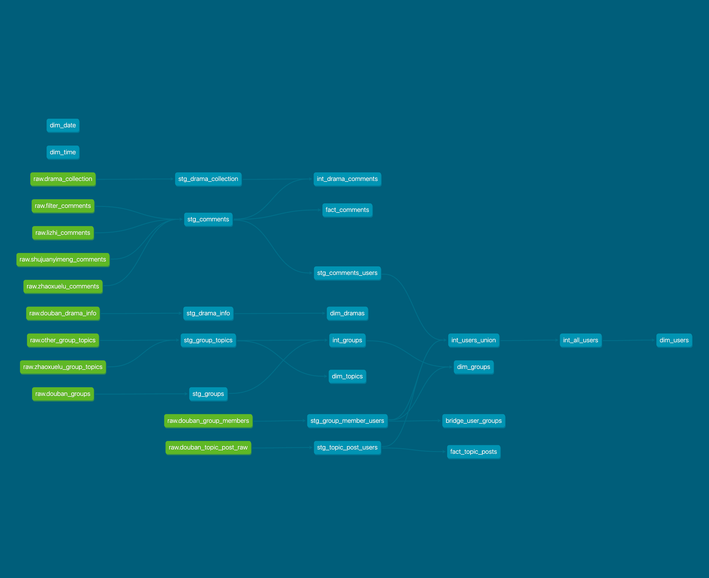

# 📊 Zhao Xue Lu – dbt Analytics Project

## Overview

This repository contains the **dbt (data build tool) project** for transforming and analyzing audience feedback data related to the Chinese drama **《朝雪录》 (Zhao Xue Lu)**.

The goal of this project is to transform **raw scraped comment data** into a **clean, reliable, and analytics-ready data warehouse layer**, enabling deeper insights into:

* Audience sentiment and behavior
* Rating anomalies and manipulation patterns
* Time-based engagement trends
* Content-driven discussions

This project is part of a larger **end-to-end data engineering pipeline**, where:

* Data ingestion (scrapers, Kafka, Airflow) happens upstream
* dbt handles transformation, modeling, and data quality
* BI tools consume curated datasets for analysis

---

## 🏗️ Architecture

```text
Raw Data Layer (PostgreSQL)
   └── public.zhaoxuelu_comments

Transformation Layer (dbt)
   ├── staging (views)
   │     └── stg_zhaoxuelu_comments
   ├── intermediate (optional)
   │     └── int_*
   └── marts (tables)
         └── fact_comment_rating_hourly

Serving Layer
   ├── BI tools (Metabase / Superset)
   ├── Streamlit dashboards
   └── Analytical queries
```

---

## 📐 Data Modeling Approach

This project follows a **layered modeling strategy inspired by modern data warehouse design**.

### 1. Staging Layer

* Cleans raw data
* Standardizes data types
* Removes invalid or duplicate records

Typical transformations:

* Cast timestamps
* Normalize rating values
* Clean text fields

---

### 2. Mart Layer (Star Schema)

The mart layer is designed for **analytics performance and usability**.

#### Fact Table

* `fact_comment_rating_hourly`

  * Aggregated comment counts per hour
  * Rating distribution metrics

#### Future Dimensions

* `dim_users`
* `dim_dramas`
* `dim_time`

---

## 🔍 Key Features

* ✅ Modular SQL transformations using dbt
* ✅ Data quality tests (`not_null`, `unique`, `relationships`)
* ✅ Clear separation of staging and marts
* ✅ Time-series aggregation for behavioral analysis
* ✅ Designed for scalability (Kafka + Airflow ready)

---

## 📊 Example Use Cases

* Detect abnormal rating spikes (potential manipulation)
* Analyze user engagement patterns over time
* Compare sentiment trends across episodes
* Identify coordinated low-rating behavior

---

## 📚 Documentation & Lineage

This project uses **dbt Docs** to provide:

* Model-level documentation
* Column descriptions
* Data tests
* Full lineage graph from raw → marts

### ▶ Run documentation locally

```bash
uv run dbt docs generate
uv run dbt docs serve
```

Then open:

```
http://localhost:8080
```

---

## 🧬 Lineage Graph

Below is the transformation lineage from raw data to analytics layer:



> The lineage graph illustrates how raw data is progressively transformed into structured analytical models, ensuring transparency and traceability in the data pipeline.

---

## 🚀 Future Improvements

* Add user-level dimension tables
* Integrate AI-labeled sentiment data
* Build anomaly detection models
* Add real-time pipeline support (Kafka + streaming)

---

## 🛠 Tech Stack

* **dbt (Core)**
* PostgreSQL
* Python (data ingestion)
* Streamlit (dashboarding)

---

## 👤 Author

**Cindy Gao**
Data Engineering & Analytics Enthusiast
